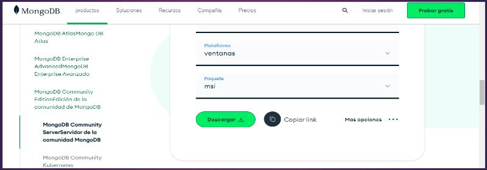

# Elementos de investigación operativa

## Clase 1

### Administrador de base de datos

Un administrador de base de datos es aquel que se encarga de la manipulación de datos de una empresa, organizando y estructurando, dando paso al manejo fluido de los datos.

#### Tareas del administrador de datos

- Crear la base de datos y planificar su estructura
- Maneja los datos
- Normaliza los datos para mayor fluidez
- Asegura los datos

### Base de datos

- Hay varios tipos de base de datos en muchos tipos en la base.
- La mejor base de datos para una organización específica dependerá de cómo la utiliza la organización.

#### Tipos de bases de datos

- Bases de datos relacionales
- Bases de datos orientada a objetos
- Bases de datos distribuidos o almacenes de datos
- Bases de datos SQL
- Bases de datos orientadas a grafos
- Bases de datos o RTP

##### Base de datos relacional

- Los elementos se organizan como un conjunto de tablas con columnas y filas
- La tecnología de base de datos relacional proporciona la manera más eficiente y flexible de acceder a la información estructurada.
- Las bases de datos relacionales, los que las caracteriza son las relaciones que DNS y como se guardan los datos.
- Los datos se están guardando mediante tablas, llaves foráneas, llaves principales y éstas se relacionan entre sí y eso caracteriza las bases de datos relacionales.
- Así como tiene sus ventajas de ser eficiente y flexible.
- También tiene su desventaja, la cual algunas bases de datos que son de bases de datos relacionales pierden un poco de escalabilidad.

##### Base de datos NoSQL

- Esta permite que los no estructuradas y semi estructuradas se me acerquen y manipule.
- A diferencia en el valor de la escena que define como debe comportarse todos los datos insertados en la base de datos, ese tipo de registros de bases de datos, los cuales se guían por claves-valor, no se guardan en tablas, sino que en documentos.
- Y estos no tienen una relación en sí, sino que solo se guardan de esa manera, dentro de colecciones para saber lo que son datos y se accede a la colección y después de la colección, a los documentos.

##### Base de datos orientada a objetos

- Agrupa la información en paquetes relacionados entre sí.
- Los datos de cada registro se combinan en un solo objeto, con todos sus atributos.
- De esta manera la información esta disponible en un solo objeto, ya que sus datos quedarán agrupados y no distribuidos en diferentes tablas.

##### Base de datos distribuidos

- Estas bases de datos consisten en que los datos o los archivos que se están guardando están dispersos.
- Se almacenan en diversos dispositivos, computadoras, servidores que son de la misma ubicación física pero dispersa en diferentes redes.

### ¿Que es un dato?

- Es un representación de una variable que puede ser cuantitativa o cualitativa.
- Es decir, que me puede indicar un valor que se le asigna a las cosas y que se representa por una secuencia de símbolos, números y letras.
- Un dato puede ser representado , por ejemplo, como la edad de una persona.

### Tipos de datos y su clasificación

- Tipo de dato numérico: entero y decimal.
- Tipo de dato de texto:
    Los tipos de datos de texto se clasifica en dos, el carácter es un dato formado por una unidad o símbolo, que puede ser una letra, un número, una mayúscula o un signo de puntuación. Y las cadenas son un dato formado por un conjunto de caracteres dispuesta de forma concecutiva qué se representa entre comillas, para que el sistema la detecte como una cadena de texto.
- Datos lógicos:
    El booleano es un tipo de dato que puede representar sólo dos valores, verdadero o falso. No se puede representar ningún otro valor, solo verdadero o falso.

### Sistema gestor de datos

Es un conjunto de programas que permite el almacenamiento, modificación y extracción de la información en una base de datos. Cuando hablamos de un gestor de base de datos, hablamos de software que nos permite manipular lo que es una base de datos, ya sea ingresar, crear, eliminar o modificar lo que son los datos o la base de datos en sí.

### Mongo DB parte 1

Es un gestor de base de datos no relacional, osea NoSQL, el cual no utiliza el mismo concepto o la misma finalidad que la base de datos relacional, ya que este no tiene una estructura o dos datos estructurados y orientado a objetos o a documentos.

### Actividad C01

Responder las siguientes preguntas:

1. ¿Qué tarea realiza el administrador de una base de datos?
2. Menciona dos tareas que realiza el administrador de datos
3. Mencione 2 tipos de base de datos
4. ¿Qué tipos de datos existen?

## Clase 2 - Base de datos NoSQL

Cuando hablamos de bases de datos NoSQL, nos referimos al conjunto de datos no relacionales.

Es una amplia base de datos, la cual no utiliza lenguaje SQL como lenguaje principal de consulta, sino que se maneja con documentos.

### Ventajas

#### Productividad

- En el desarrollo de aplicaciones. El sistema NoSQL nos proporciona un modelo de datos que encajan con las necesidades de las aplicaciones.
- Es adaptable y cuando surge las bases NoSQL, produjo muchas migraciones de una base de datos relacional a una no relacional.

#### Datos a gran escala

Esta base de datos esta diseñada para ejecutarse sobre clústers. Me va a permitir manejar mucha cantidad de base de datos.

### Características

- No utiliza SQL como lenguaje principal
- Generalmente es de código abierto
- No posee un esquema fijo

### Modelos de base de datos NoSQL

#### Modelo clave valor

Se basa en un método simple clave-valor. Almacenando los datos como un conjunto de pares clave-valor, en la que una clave sirve como un identificador único.

#### Modelo orientado a documento

Una base de datos orientada a documentos. Es un subconjunto de bases de datos NoSQL, siendo esta base de datos semi-estructurada. Estas bases se almacenan en documentos y sobre esos documentos se realizan las consultas.
Por ejemplo: Facebook utiliza base de datos no relacionales ya que maneja muchos datos de usuarios.

##### Documentos

Cuando hablamos de documentos, no nos referimos a los documentos que tenemos en nuestra computadora, sino a documentos de base de datos NoSQL, estos serian lo que en una base de datos relacionales llamamos filas o tuplas.

#### Modelo basado en columnas

La base de datos basada en columnas son creadas para la velocidad, trabajan de una forma que permite omitir los datos irrelevantes para el análisis y leer de inmediato lo que se busca.

### Mongo DB parte 2

Es una base de datos, que va a funcionar mediante documentos, osea que todos los datos en los que se trabaja se almacenan en documentos.

#### ¿Cómo es el almacenamiento en Mongo DB?

Mongo DB almacena los datos estructurados de forma JSON (notación de objetos basados en JavaScript), utilizando un esquema dinámico llamado BSON (esquema no fijo) que es actualizable.

#### Los documentos contiene múltiples pares clave valor

Cuando decimos que los documentos contienen múltiples pares clave valor nos referimos a que las claves serian como los atributos en MySQL y el valor a los datos que se almacenan en un campo.

#### Características de Mongo DB

- Las claves están definidas como cadenas y puede utilizarse cualquier carácter.

- En las claves no pueden quedar el valor nulo/0 o usar "." o "$" ya que tienen propiedades especiales (no se pueden utilizar ese tipo de caracteres)

- Mongo DB es sensitivo a como se escriben los datos (mayúsculas y minúsculas):

    ```JSON
    {"USUARIO": "kevin 503"}, {"usuario": "kevin 503"}
    ```

    Va a cambiar el concepto de la clave.

- Un documento no puede tener la clave duplicada (las claves deben ser de diferentes formas)


### Instalaciones

Mongo DB
ROBO 3T

Seguir los paso que se indican en los tutoriales.

#### Mongo DB - Instalación

En el buscador escribiremos Mongo DB, una vez que nos aparece la página, ingresaremos en el enlace Community Edition.


Una vez que ya ingresamos al enlace, nos aparecerá una página donde seleccionaremos la versión mas actual.


Una vez seleccionamos la versión que deseamos instalar, iniciamos la descarga.



#### ROBO 3T - Instalación

En el buscador escribimos ROBO 3T, una vez que nos aparece en la página, seleccionamos el primer enlace.


Una vez que ingresamos al enlace, nos abrirá la pagina principal.


Iniciaremos la descarga de ROBO 3T


### Actividad C02

Trabajo práctico n°1 grupal:

Realizar un mapa mental con los principales puntos de base de datos no relacionales vistas en las clases 1 y 2.

Enviar trabajos con los nombres y apellidos de quienes participaron.
