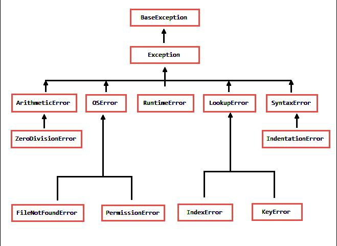
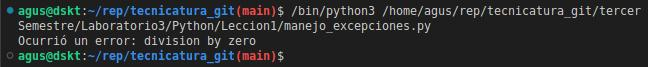
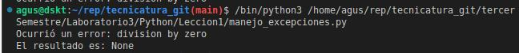
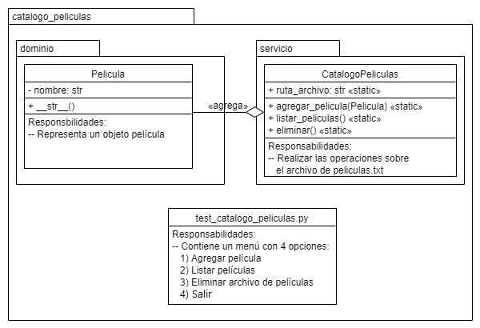

# Laboratorio 3 - Python

## Clase 01: Excepciones

Vamos a trabajar sobre excepciones en python en un nuevo proyecto llamado [Lección 1](./Leccion1).

En la siguiente imagen podemos ver un árbol de jerarquías de
clases de excepciones.



La clase padre de todas las excepciones es `BaseException`,
luego la clase `Exception` hereda todas las características de su clase padre. A la hora de trabajar capturando excepciones mayormente, usaremos `Exception`.
Ya que al utilizar `Exception` capturamos todas las excepciones
de sus clases hijas.

Vamos a generar un error, que interrumpe la ejecución de un programa, este error que vamos a producir, es la división por cero. Y vamos a capturar la excepción, para que justamente no se interrumpa la ejecución del programa. Para hacer esto vamos a envolver el código en un `try`, esa es un palabra reservada de python, y básicamente le dice al compilador intenta realizar esta tarea, luego se continua por la palabra `except` donde indicaremos que clase de excepción deseamos capturar.

```python
# manejo_excepciones.py
a = 10
b = 0
try:
    a/b
except Exception as e:
    print(f'Ocurrió un error: {e}')
```

En este caso, al usar `Exception` como clase a capturar, también lo estaremos haciendo para sus clases hijas, y asignando su valor a `e` y luego imprimiendo por consola, veremos a cual de las clases hijas corresponde el la excepción capturada.



Vemos que la excepción capturada e impresa por consola es `division by zero`.

Ahora veremos el mismo ejemplo, pero imprimiendo un resultado después de los bloques try/except.

```python
# manejo_excepciones.py
resultado = None
a = 10
b = 0

try:
    resultado = a / b
except Exception as e:
    print(f'Ocurrió un error: {e}')

print(f'El resultado es: {resultado}')
```

Y la ejecución queda así:



Podemos ver claramente que, aunque ha surgido una excepción, a la hora de realizar la operación de division, el programa sigue ejecutándose.

Para poder procesar clases de excepciones mas especificas. Aca vamos a ver las jerarquía.
En el vamos a observar al ejecutar la operación un ERROR de tipo ZeroDivisionError.

```python
# manejo_excepciones.py
resultado = None
a = 10
b = 0

try:
    resultado = a / b
except TypeError as e:
    print(f'TypeError - Ocurrió un error: {type(e)}')
except ZeroDivisionError as e:
    print(f'ZeroDivisionError - Ocurrió un error: {type(e)}')
except Exception as e:
    print(f'Exception - Ocurrió un error: {type(e)}')

print(f'El resultado es: {resultado}')
```

En cambio si cambiamos el tipo de numero a String en la variable "a", el tipo de Error es TypeError.

```python
# manejo_excepciones.py
resultado = None
a = "10"
b = 0

try:
    resultado = a / b
except TypeError as e:
    print(f'TypeError - Ocurrió un error: {type(e)}')
except ZeroDivisionError as e:
    print(f'ZeroDivisionError - Ocurrió un error: {type(e)}')
except Exception as e:
    print(f'Exception - Ocurrió un error: {type(e)}')

print(f'El resultado es: {resultado}')
```

Podemos crear nuestras variables dentro del try, pero van a hacer exclusivas dentro del try. También podemos pedir el valor de nuestras variables.

```python
# manejo_excepciones.py
resultado = None

try:
    a = int(input('Digíte el primer numero: '))
    b = int(input('Digíte el segundo numero numero: '))

    resultado = a / b
except TypeError as e:
    print(f'TypeError - Ocurrió un error: {type(e)}')
except ZeroDivisionError as e:
    print(f'ZeroDivisionError - Ocurrió un error: {type(e)}')
except Exception as e:
    print(f'Exception - Ocurrió un error: {type(e)}')

print(f'El resultado es: {resultado}')
```

 El caso de 'else' se va a ejecutar cuando no se haya lanzado ninguna excepción se va a ejecutar este bloque.

```python
# manejo_excepciones.py
resultado = None

try:
    a = int(input('Digíte el primer numero: '))
    b = int(input('Digíte el segundo numero numero: '))

    resultado = a / b
except TypeError as e:
    print(f'TypeError - Ocurrió un error: {type(e)}')
except ZeroDivisionError as e:
    print(f'ZeroDivisionError - Ocurrió un error: {type(e)}')
except Exception as e:
    print(f'Exception - Ocurrió un error: {type(e)}')
else:
    print(' No se arrojo ninguna exception')
finally:
    print(' Ejecución del bloque del finally')
print(f'El resultado es: {resultado}')
```

 y en el bloque del finally siempre se va a ejecutar, haya encontrado una excepción o no.

También se pueden crear nuestras propias excepciones.
creamos una clase que extiende de la clase Exception
y desde ahi creamos el mensaje.

```python
# NumerosIgualesException.py
class NumerosIgualesException (Exception):  
    def __init__(self, mensaje):
        self.message = mensaje
```

En la clase principal donde manejamos las excepción importamos la clase.
En este caso con un if comparamos la variable a y b. Y con la palabra reservada 'raise' nos permite lanzar una excepción. en el cual le asignamos un mensaje.

```python
# manejo_excepciones.py
from NumerosIgualesException import NumerosIgualesException
resultado = None

try:
    a = int(input('Digíte el primer numero: '))
    b = int(input('Digíte el segundo numero numero: '))
    if a == b:
        raise NumerosIgualesException('Son numeros iguales')
    resultado = a / b
except TypeError as e:
    print(f'TypeError - Ocurrió un error: {type(e)}')
except ZeroDivisionError as e:
    print(f'ZeroDivisionError - Ocurrió un error: {type(e)}')
except Exception as e:
    print(f'Exception - Ocurrió un error: {type(e)}')
else:
    print(' No se arrojo ninguna exception')
finally:
    print(' Ejecución del bloque del finally')

print(f'El resultado es: {resultado}')
```

## Clase 2 - Manejo de archivos

## Clase 3 - Laboratorio final - catalogo de películas

En esta clase vamos a trabajar a partir de un diagrama uml, este diagrama describe un paquete llamado `catalogo_peliculas`, el cual tiene dos sub paquetes, uno llamado `dominio` que contiene una clase llamada `Pelicula` y otro sub paquete llamado `servicio` que contiene la clase llamada `CatalogoPeliculas`, esta clase contendrá los métodos para `agregar_pelicula`, `listar_peliculas` y `eliminar`. Estos métodos realizaran operaciones sobre un archivo `peliculas.txt`.

Luego también tendremos un archivo `test_catalogo_peliculas.py`, que estará alojado en el paquete principal, justamente para hacer una prueba de que el proyecto funciona correctamente.



La clase `Pelicula`, va a contener el atributo `nombre`, que es un atributo privado de tipo string. También sobre escribiremos el método `__str__()`. Y sus responsabilidades de representar el objeto película. Esta se encuentra en un paquete de nombre `dominio`, por que es la clase de dominio del problema.

La clase `CatalogoPeliculas`, se encuentra en el paquete `servicio`, por que esta sera la clase que servicio del problema.

### Arquitectura de proyectos python

La arquitectura de paquetes en un proyecto de Python

es la forma en que se organizan y estructuran los archivos y módulos de Python en un proyecto más grande. La organización de los archivos y módulos en paquetes facilita la reutilización y el mantenimiento del código, y también ayuda a mantener el código organizado y legible.

Un paquete de Python es simplemente una carpeta que contiene uno o más módulos de Python. Cada paquete debe contener un archivo `__init__.py`, que se utiliza para inicializar el paquete y definir cualquier configuración o variables que se necesiten para el paquete. Los nombres de los paquetes deben seguir las convenciones de nomenclatura de Python, que suelen ser en minúsculas y separados por guiones bajos.

A continuación, se muestra un ejemplo de una arquitectura de paquetes típica para un proyecto de Python:

```markdown
my_project/
├── __init__.py
├── main.py
├── utils/
│   ├── __init__.py
│   ├── file_utils.py
│   └── math_utils.py
├── data/
│   ├── __init__.py
│   ├── data_loader.py
│   └── data_preprocessor.py
└── models/
    ├── __init__.py
    ├── model.py
    └── evaluation.py
```

En este ejemplo, el paquete principal es `my_project`, que contiene el archivo `__init__.py` y el archivo principal `main.py`. El paquete utils contiene dos módulos, `file_utils.py` y `math_utils.py`, que proporcionan funciones de utilidad para el proyecto. El paquete data contiene los módulos `data_loader.py` y `data_preprocessor.py`, que se utilizan para cargar y procesar los datos utilizados por el proyecto. Finalmente, el paquete `models` contiene el módulo `model.py` que define el modelo utilizado en el proyecto y el módulo `evaluation.py` que se utiliza para evaluar el modelo.

Los términos "dominio" y "servicios" no son términos comunes en la arquitectura de paquetes de Python, pero se pueden interpretar de la siguiente manera:

- Un paquete de "dominio" en un proyecto de Python generalmente contendría módulos que definen las reglas de negocio, lógica y estructuras de datos de la aplicación. Por ejemplo, si estuviéramos construyendo una aplicación de comercio electrónico, el paquete de "dominio" podría contener módulos que definen las clases de productos, clientes, pedidos, métodos de pago, etc.

- Un paquete de "servicios" en un proyecto de Python generalmente contendría módulos que se encargan de la lógica del negocio, como la gestión de la autenticación, la interacción con APIs de terceros, la gestión de pagos, el envío de correos electrónicos, etc. Estos módulos se utilizan para implementar las funcionalidades de la aplicación y se pueden utilizar en diferentes partes del proyecto.

Por supuesto, estas definiciones pueden variar según el proyecto y la arquitectura general de la aplicación, pero en general, estas son las áreas de responsabilidad que se podrían asignar a los paquetes de "dominio" y "servicios".

