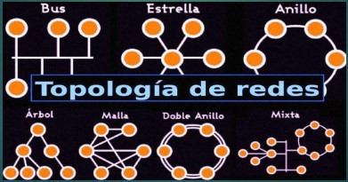

# Organización empresarial

## Clase 1 - Seguridad

### Red

Cuando hablamos de red estamos hablando de más de dos dispositivos conectados. Si se tiene acceso a internet inmediatamente estamos siendo parte de una red. Nuestra computadora estará conectada con el mundo.

### El router

También llamado modem o switch, es un dispositivo que me va a permitir conectarme al servicio inalámbrico que seria wifi. Es el que va a centralizar el acceso a internet.

### IP

La IP es lo que permite individualizar a un dispositivo dentro de  la red que vendría a ser como nuestro número de documento o su pasaporte.

Dependiendo en cada país puede variar un poco el nombre, ese número único, irrepetible, que los identifica como personas.

### IP privada y IP pública

La IP privada va a variar según el dispositivo que se conecte a esta por ejemplo dentro de un hogar, en el trabajo, en un establecimiento estatal, en una escuela, etc.

La IP pública va a ser la misma con cada dispositivo, porque todos los dispositivos salen a través de un mismo router, todos están centralizado en el router.

Por ejemplo un café, una plaza, un centro comercial, etc.

### ISP

Es nuestro proveedor de internet, es la compañía, la empresa que ustedes contratan para que les provea internet.

### Protocolo

Es un conjunto de normas a través de las cuales se pueden realizar la transmisión de información de datos entre dos computadoras.

Un ejemplo es el protocolo TCP/IP, que es el protocolo de internet y a través de él es que se pueden comunicar en esa gran red las diferentes computadoras, y es lo que caracteriza al protocolo.

Permite que diferentes sistemas operativos se puedan comunicar entre sí.

### Puerto

Es una dirección física o lógica de una computadora o servicio.

### Servicio 

Nos va a brindar seguridad y permitirnos la operación de recursos entre computadoras.

Es el cual se suele configurar con la finalidad de, por ejemplo, brindar una mayor seguridad.

### Actividad C01

Responder:

1. ¿A qué llamamos una red?
2. ¿Cuál es la diferencia entre una IP pública y una IP privada?
3. ¿Cuál es la diferencia entre protocolo y puerto?

## Clase 2 - Ciberseguridad

### RED

Cuando hablamos de una red decimos que un conjunto de equipos informáticos interconectados entre sí.

En toda red, hay una parte física y otra lógica.

La parte física, está compuesta por todos los elementos materiales (hardware), y los medios de transmisión.

La parte lógica (software), son los programa que gobiernan o controlan esa transmisión y la información o datos que es transmitida.

### Topologías de red

¿Qué es la topología  de red?

Se denomina topología de red a la forma en que se organizan los componentes de una red (cables, tarjetas de red, otros equipos, etc.).

Por lo tanto, es la forma, la apariencia de la red.

Topologías de una red = a la forma física que tienen los equipos y el cableado de la red.

Dependiendo de la disposición física, es decir la configuración espacial del equipo de red, se distinguen las siguientes topologías:

#### Red de Bus

Una red de Bus o en Bus es una arquitectura de comunicación donde la conexión de los equipos la proporciona un bus compartido por todos los usuarios.

Bus = cable para transportar la información en las redes de ordenadores.

En definitiva es un solo cable (bus) el que lleva la información de un sitio a otro de la red.

Las redes de bus permiten conectar varios dispositivos de forma sencilla, pero causan problemas cuando dos máquinas quieren transmitir datos al mismo tiempo en el bus.

Los sistemas que utilizan una topología de bus normalmente tienen un arbitro que administra el acceso al bus.

Esta topología de bus se ha utilizado ampliamente por su bajo costo de instalación.

Es muy fácil conectar varias estaciones en la misma habitación, por ejemplo para conectar dos o tres ordenadores en casa.

#### Red en anillo

La topología de anillo parece un bus pero que estaría cerrado sobre sí mismo, el ultimo nodo está conectado al primero.

En la red en anillo cada estación tiene una única conexión de entrada y otra de salida de anillo.

Cada nodo tiene asignada una dirección que es una secuencia numérica única que lo identifica respecto a los demás dentro de la red a la que pertenezca.

El nodo puede ser un ordenador, pero también una impresora. Cada uno de los nodos se comunica por turno.

Utiliza el método de acceso a "token" (Token ring). Los datos pasan de una estación a otra siguiendo el anillo que cada vez regenera la señal

#### Red en estrella

En esta topología están todos conectados a un nodo central.

Utilizado en particular por las redes Ethernet, ahora es la topología de la mayoría de las redes.

Un switch recibe un paquete, lo procesa para determinar si dirección de destino y lo reenvía a la dirección de destino revelada.

Lo importante es que para hablar con otra entidad u ordenador pasamos siempre por el equipo o nodo central.

#### Red de doble anillo

El principio es el mismo que el de la topología de anillo, excepto que se agrega un anillo adicional que servirá como respaldo en caso de que falle el anillo principal.
La topología de doble anillo actúa como si fueran dos anillos independientes, de los cuales se usa solamente uno por vez.

Uno de los anillos se utiliza para la transmisión y el otro actúa como anillo de seguridad o reserva, por si ocurre algún problema con el primero.

Una tecnología que utiliza esta topología es FDDI, es la interfaz de datos distribuidos por fibra.

#### Red de árbol (o jerárquica)

Una topología de árbol o jerárquica se puede considerar como una colección de redes en estrella organizadas en un orden o jerarquía.

Esta red se divide en niveles.

El nivel superior, alto, está conectado a varios nodos de nivel inferior, en la jerarquía.

Estos nodos pueden conectarse ellos mismo a varios nodos de nivel inferior.

Como en la red en estrella convencional, los nodos individuales pueden quedar aislados de la red por un fallo de un solo punto de una ruta de transmisión al nodo.

Si falla un enlace que conecta una rama, esa rama está aislada.

Si falla una conexión a un nodo, una sección completa de la red queda aislada del resto.

#### Red en malla

La red en malla es una topología de red que califica las redes (cableadas o no) en las que todos los ordenadores están conectados entre pares sin una jerarquía central, formando así una estructura en forma de red. Por lo tanto, cada nodo debe recibir, enviar y retransmitir datos.

Esto evita tener puntos sensibles, que en caso de fallo, aíslan parte de la red. Si un nodo no funciona, sis vecinos usarán una ruta diferente.

Las redes de malla utilizan varias rutas de transferencia entre diferentes nodos.

Este método garantiza la transferencia de datos en caso de fallo del nodo.

#### Red mixta o híbrida

Se trata de dos tipos diferentes de topologías que don una mezcla de dos o más topologías.

Por ejemplo, si en una oficina de un departamento se usa una topología en anillo y en otro se usa una topología en estrella, la conexión de estas topologías dará como resultado una topología híbrida (topología en anillo y topología en estrella)

### Topologías lógicas

Topología lógica, a diferencia de la topología física anterior, representa cómo viajan los datos en las líneas de comunicación.

Las topologías lógicas más comunes son Ethernet, Token Ring y FDDI.

### Packet trace

Por el buscador ingresaremos el nombre de la herramienta e ingresaremos al primer enlace.

Descargar la herramienta que les permitirá realizar el dibujo de las topologías de red.

### Actividad C02

Trabajo practico grupal n°1

1. Utilizar la herramienta gratuita Packet trace de Cisco para graficar las diferentes topologías de red.
2. Realizar un cuadro comparativo con las ventajas y desventajas de cada topología de red.
